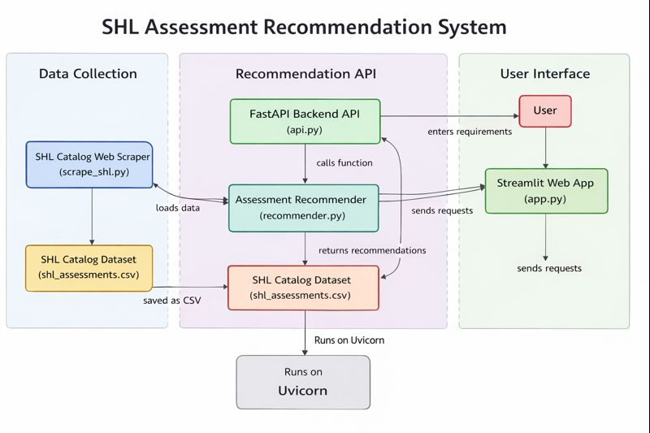

# 🧠 SHL Assessment Recommendation System

A production-ready **SHL Assessment Recommendation System** that recommends relevant SHL assessments based on a recruiter’s hiring requirement or job description.

The system is built as an end-to-end application with a backend recommendation API and a user-friendly web interface.

---

## 🚀 Live Application

### 🔹 Web Application (Frontend)
👉 https://shl-assessment-recommendation-mx8m.onrender.com/
### 🔹 Backend API (FastAPI – Render)
- Health Check:  
  👉  https://shl-assessment-recommendation-mx8m.onrender.com

---

## 🔗 Source Code

👉 https://github.com/SSR1516/shl-assessment-recommendation/tree/main

The repository contains:
- Recommendation logic
- Backend API implementation
- Frontend UI
- Evaluation scripts
- Deployment configuration

---

## 🧠 Problem Overview

Recruiters often struggle to choose the right assessments from a large catalog.  
This system takes a **natural language query or job description** and recommends the most relevant **SHL assessments** to evaluate candidates effectively.

---

## 🏗️ System Architecture

The following diagram illustrates the end-to-end architecture of the SHL Assessment Recommendation System, covering data processing, backend API flow, and user interface.



## 🏗️ System Flow

The system follows a clean, modular architecture where each component has a well-defined responsibility.
## 🧠 System Architecture Flow

```text
User (Browser)
     |
     v
Streamlit Frontend (UI)
     |
     v
FastAPI Backend (Hosted on Render)
     |
     v
TF-IDF Vector Recommender Engine
     |
     v
SHL Assessment Catalog (CSV Dataset)


## ⚙️ Technology Stack

- **Backend**: FastAPI
- **Frontend**: Streamlit
- **ML / NLP**: TF-IDF + Cosine Similarity
- **Evaluation**: Recall@10
- **Deployment**:
  - Backend: Render
  - Frontend: Streamlit Cloud
- **Language**: Python 3.10

---

## 🔍 Recommendation Approach

### 1. Text Representation
Each SHL assessment is represented using:
- Assessment name
- Description
- Test type (Knowledge / Personality)

TF-IDF vectorization is applied to convert text into numerical vectors.

---

### 2. Similarity Search
- Recruiter query is vectorized using the same TF-IDF model
- Cosine similarity is computed against all assessments
- Top-K most similar assessments are retrieved

---

### 3. Domain-Aware Re-ranking
If a query contains both:
- Technical signals (e.g., Java, Python, SQL)
- Behavioral signals (e.g., collaboration, leadership)

The system balances recommendations between:
- Knowledge/Skill tests
- Personality/Behavior tests

---

## 📊 Evaluation

- Metric: **Mean Recall@10**
- Dataset: SHL-provided labeled train set
- URL normalization is applied during evaluation to avoid formatting mismatches

### Observation:
The TF-IDF baseline achieves a low Recall@10 due to:
- Long and generic job descriptions
- Strict URL-level matching
- Lexical (non-semantic) retrieval limitations

These results highlight the need for semantic embeddings in future iterations.

---

## 📁 Project Structure

```bash
shl-assessment-recommendation-system/
│
├── backend/
│   ├── api/
│   │   └── app.py                # FastAPI application entry point
│   │
│   └── core/
│       └── recommender.py        # TF-IDF recommendation logic
│
├── frontend/
│   └── app.py                    # Streamlit frontend UI
│
├── experiments/
│   ├── evaluate.py               # Model evaluation script
│   └── generate_submission.py    # Submission file generator
│
├── data/
│   ├── processed/                # Cleaned SHL assessment data
│   └── evaluation/               # Train / test datasets
│
├── docs/
│   └── approach.md               # Solution approach & methodology
│
├── requirements.txt              # Python dependencies
├── runtime.txt                   # Python runtime version (Render)
└── README.md                     # Project documentation
---

## ▶️ Running Locally

### 1️⃣ Install dependencies
```bash
pip install -r requirements.txt


---

## ▶️ Running Locally

### 1️⃣ Install dependencies
```bash
pip install -r requirements.txt

2️⃣ Run the application
python app.py

☁️ Deployment Notes

The application is deployed on Render (Free Tier).

The backend may take 15–30 seconds to wake up after inactivity.

If the app does not respond immediately, please refresh and try again.

🚧 Limitations & Future Improvements

TF-IDF captures lexical similarity but not deep semantic meaning.

Transformer-based embeddings can improve recommendation quality.

Additional filters such as duration and difficulty level can be added.

👤 Author

Sejal Singh
📧 Email: sejalsingh910@gmail.com   

